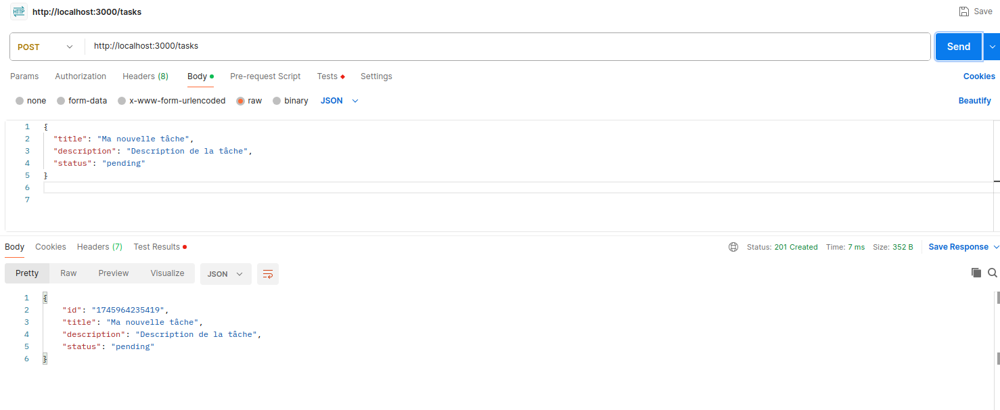
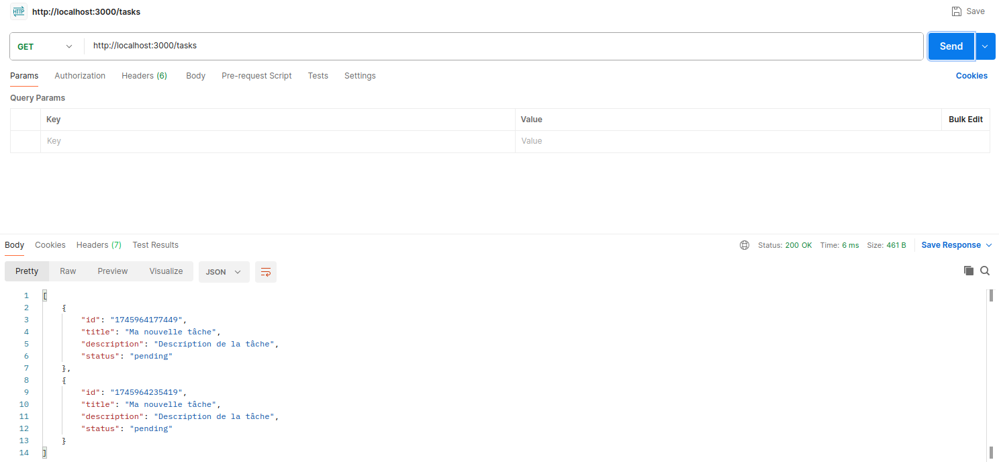
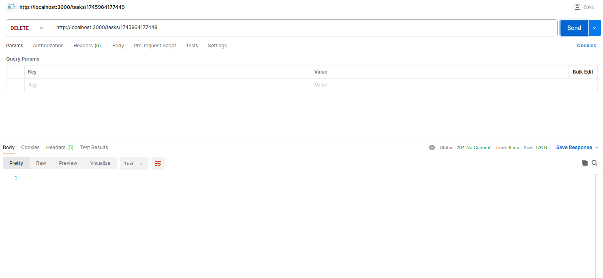
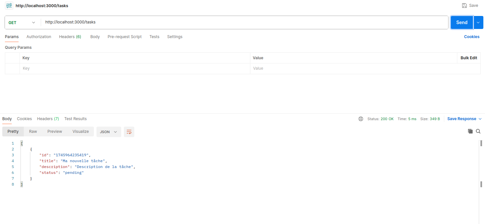
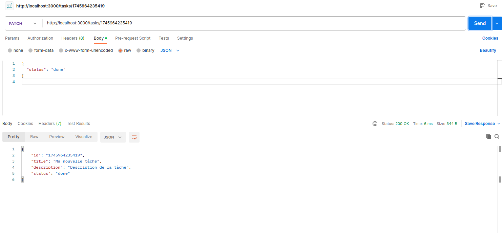

# gestion_de_taches
##### BACKEND
#  Gestionnaire de Tâches - Backend

Ce backend Node.js/Express fournit une API REST pour la gestion de tâches (CRUD). Il fonctionne indépendamment du frontend et stocke les données temporairement en mémoire.

## Architecture du projet

``` bash
.
├── src/
│   ├── controllers/
│   │   └── taskController.ts   # Logique métier
│   ├── routes/
│   │   └── taskRoutes.ts       # Définition des routes
│   ├── services/
│   │   └── taskService.ts      # Gestion des données en mémoire
│   ├── models/
│   │   └── task.ts             # Interface Task
│   └── app.ts                  # Point d'entrée de l'application
```

---

##  Lancement du serveur

```bash
# Installer les dépendances
npm install

# Lancer le serveur en mode développement
npm run dev
```

Le serveur démarre sur http://localhost:3000.


## Endpoints disponibles

```bash
Méthode | URL        | Description                   |
------------------------------------------------------
GET     | /tasks     | Liste toutes les tâches       |
POST    | /tasks     | Crée une nouvelle tâche       |
PATCH   | /tasks/:id | Modifie le statut d’une tâche |
DELETE  | /tasks/:id | Supprime une tâche par son ID |
```

## Validation des données
Chaque création ou mise à jour de tâche est validée via Zod pour garantir :

```bash
title: chaîne non vide

description: chaîne non vide

status: "pending" ou "done"

```

### Créer une tâche
```bash
POST http://localhost:3000/tasks
Content-Type: application/json

{
  "title": "Ma nouvelle tâche",
  "description": "Description de la tâche",
  "status": "pending"
}
```


### Récupérer les tâches
```bash
GET http://localhost:3000/tasks
```


### Supprimer une tâche
```bash
DELETE http://localhost:3000/tasks/1714412030000
```


### Apres Supprimer une tâche j'affiche les taches
```bash
GET http://localhost:3000/tasks
```


### Modifier le statut
```bash
PATCH http://localhost:3000/tasks/1745964235419
Content-Type: application/json

{
  "status": "done"
}
```


### Remarques
```bash
Toutes les tâches sont stockées en mémoire. Aucune base de données n'est utilisée.

Les ID sont générés automatiquement à partir de Date.now().

Le backend fonctionne parfaitement et a été testé manuellement avec Postman.
```


##### FRONTEND
#  Gestionnaire de Tâches - Backend
