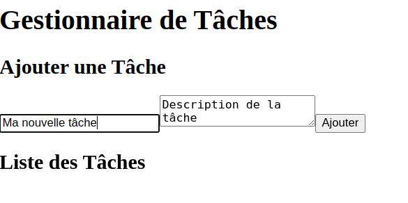
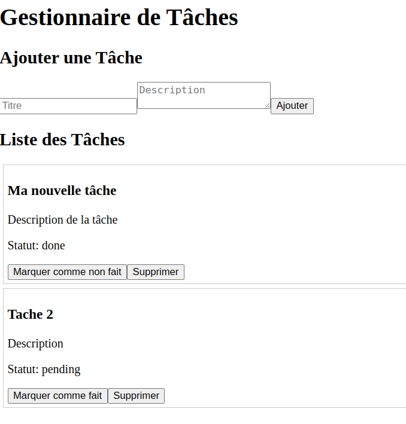
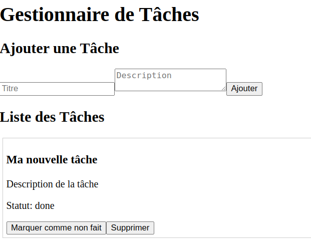
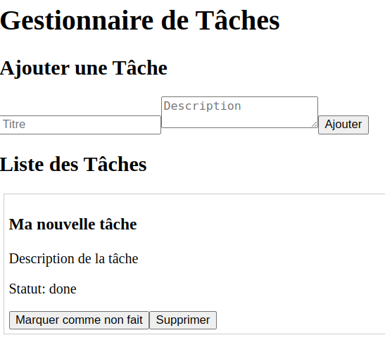

# gestion_de_taches

# BACKEND

Ce backend Node.js/Express fournit une API REST pour la gestion de tâches (CRUD). Il fonctionne indépendamment du frontend et stocke les données temporairement en mémoire.

## Architecture du projet

``` bash
.
├── src/
│   ├── controllers/
│   │   └── taskController.ts   # Logique métier
│   ├── routes/
│   │   └── taskRoutes.ts       # Définition des routes
│   ├── services/
│   │   └── taskService.ts      # Gestion des données en mémoire
│   ├── models/
│   │   └── task.ts             # Interface Task
│   └── app.ts                  # Point d'entrée de l'application
```

---

##  Lancement du serveur

```bash
# Installer les dépendances
npm install

# Lancer le serveur
npm run dev
```

Le serveur démarre sur http://localhost:3000.


## Endpoints disponibles

```bash
Méthode | URL        | Description                   |
------------------------------------------------------
GET     | /tasks     | Liste toutes les tâches       |
POST    | /tasks     | Crée une nouvelle tâche       |
PATCH   | /tasks/:id | Modifie le statut d’une tâche |
DELETE  | /tasks/:id | Supprime une tâche par son ID |
```

## Validation des données
Chaque création ou mise à jour de tâche est validée via Zod pour garantir :

  - Title: chaîne non vide
  - Description: chaîne non vide
  - Status: "pending" ou "done"

### Remarques
  - Toutes les tâches sont stockées en mémoire. Aucune base de données n'est utilisée.
  - Les ID sont générés automatiquement à partir de Date.now().
  - Le backend fonctionne parfaitement et a été testé manuellement avec Postman.

### Créer une tâche
```bash
POST http://localhost:3000/tasks
Content-Type: application/json

{
  "title": "Ma nouvelle tâche",
  "description": "Description de la tâche",
  "status": "pending"
}
```


### Récupérer les tâches
```bash
GET http://localhost:3000/tasks
```


### Supprimer une tâche
```bash
DELETE http://localhost:3000/tasks/1714412030000
```


### Apres Supprimer une tâche j'affiche les taches
```bash
GET http://localhost:3000/tasks
```


### Modifier le statut
```bash
PATCH http://localhost:3000/tasks/1745964235419
Content-Type: application/json

{
  "status": "done"
}
```


# FRONTEND

Ce projet est l'interface frontend d'un gestionnaire de tâches développé avec **React + TypeScript**. Il permet à l'utilisateur d'ajouter, visualiser, modifier et supprimer des tâches via une API RESTful.

## 🛠️ Technologies utilisées

- React
- TypeScript
- Axios (pour la communication avec l'API backend)
- Vite (pour le bundling)

##  Installation

Assurez-vous d'avoir **Node.js** installé.
```bash
npm install
```

## Lancer l'application
```bash
npm start
```

##  Structure du projet
```bash
src/
├── App.tsx                # Composant principal
├── index.tsx              # Point d'entrée
├── components/
│   ├── TaskForm.tsx       # Formulaire d'ajout de tâche
│   └── TaskList.tsx       # Liste des tâches
├── services/
│   └── taskService.ts     # Requêtes API (GET, POST, DELETE, PATCH)
└── types/
    └── Task.ts            # Interface TypeScript pour une tâche
```

## Communication avec le backend
Le frontend communique avec une API backend disponible par défaut à l’adresse :
```bash
http://localhost:3000/tasks
```

## Fonctionnalités

```bash
- Ajouter une nouvelle tâche
```


```bash
- Lister toutes les tâches
```


```bash
- Modifier le statut d’une tâche (pending / done)
```


```bash
- Supprimer une tâche
```


