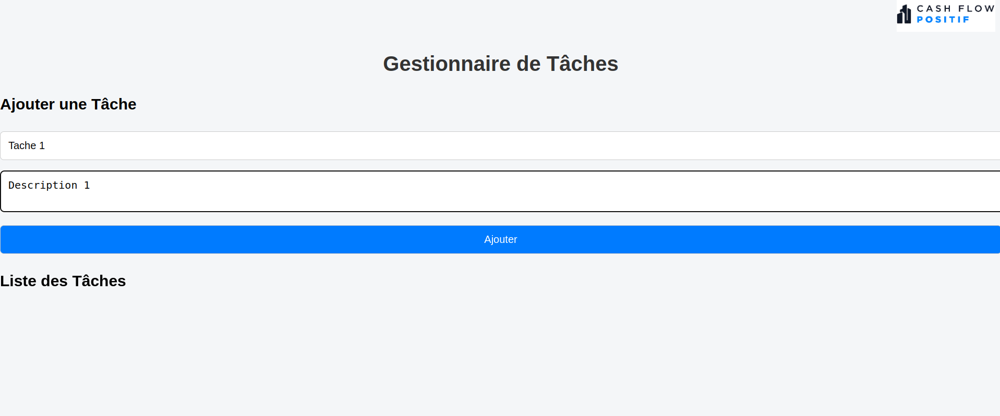
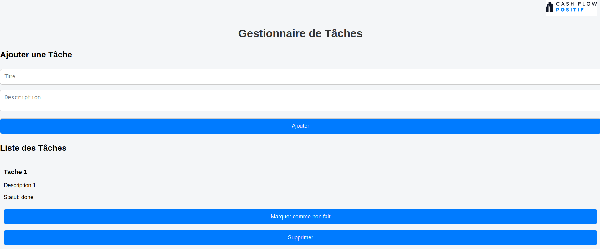
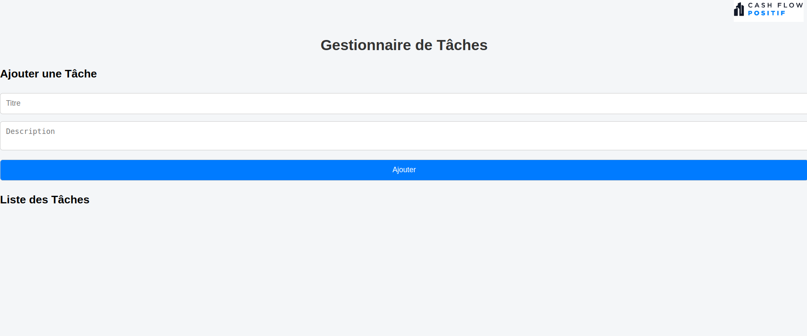

# GESTION DE TACHE
% # *********************************************************************************
% # Projet          : Gestion de Taches 
% # Date ouverture  : Jeudi 24 avril 2025 à 11:13 
% # Date à remettre : Juin
% # Réaliser par    : BARRY Saikou yaya Master 2 Architecture Logicielle
% # Email           : saikouyaya110@gmail.com
% # *********************************************************************************

Développeur Fullstack (React +
TypeScript)

# BACKEND

Ce backend Node.js/Express fournit une API REST pour la gestion de tâches (CRUD). Il fonctionne indépendamment du frontend et stocke les données temporairement en mémoire.

## Structure du backend

``` bash
.
├── src/
│   ├── controllers/
│   │   └── taskController.ts   # Logique métier
│   ├── routes/
│   │   └── taskRoutes.ts       # Définition des routes
│   ├── services/
│   │   └── taskService.ts      # Gestion des données en mémoire
│   ├── models/
│   │   └── task.ts             # Interface Task
│   └── app.ts                  # Point d'entrée de l'application
```

```bash
Le serveur démarre sur http://localhost:3000.
```


## Endpoints disponibles

```bash
Méthode | URL        | Description                   |
------------------------------------------------------
GET     | /tasks     | Liste toutes les tâches       |
POST    | /tasks     | Crée une nouvelle tâche       |
PATCH   | /tasks/:id | Modifie le statut d’une tâche |
DELETE  | /tasks/:id | Supprime une tâche par son ID |
```

## Validation des données
Chaque création ou mise à jour de tâche est validée via Zod pour garantir :

  - Title: chaîne non vide
  - Description: chaîne non vide
  - Status: "pending" ou "done"

##  Lancement du serveur

```bash
# Installer les dépendances
npm install

# Lancer le serveur
npm run dev
```


### Créer une tâche
```bash
POST http://localhost:3000/tasks
Content-Type: application/json

{
  "title": "Ma nouvelle tâche",
  "description": "Description de la tâche",
  "status": "pending"
}
```


### Récupérer les tâches
```bash
GET http://localhost:3000/tasks
```


### Supprimer une tâche
```bash
DELETE http://localhost:3000/tasks/1714412030000
```


### Apres Supprimer une tâche j'affiche les taches
```bash
GET http://localhost:3000/tasks
```


### Modifier le statut
```bash
PATCH http://localhost:3000/tasks/1745964235419
Content-Type: application/json

{
  "status": "done"
}
```


# FRONTEND

Ce projet est l'interface frontend d'un gestionnaire de tâches développé avec **React + TypeScript**. Il permet à l'utilisateur d'ajouter, visualiser, modifier et supprimer des tâches via une API RESTful.

## 🛠️ Technologies utilisées

- React
- TypeScript
- Axios (pour la communication avec l'API backend)
- Vite (pour le bundling)

##  Structure du frontend
```bash
src/
├── App.tsx                # Composant principal
├── index.tsx              # Point d'entrée
├── components/
│   ├── TaskForm.tsx       # Formulaire d'ajout de tâche
│   └── TaskList.tsx       # Liste des tâches
├── services/
│   └── taskService.ts     # Requêtes API (GET, POST, DELETE, PATCH)
└── types/
    └── Task.ts            # Interface TypeScript pour une tâche
```

## Communication avec le backend
Le frontend communique avec une API backend disponible par défaut à l’adresse :
```bash
http://localhost:3000/tasks
```

##  Installation

Assurez-vous d'avoir **Node.js** installé.
```bash
npm install
```

## Lancer l'application
```bash
npm start
```

## Fonctionnalités

```bash
- Ajouter une nouvelle tâche
```



```bash
- Lister toutes les tâches
```


```bash
- Modifier le statut d’une tâche (pending / done)
```


```bash
- Supprimer une tâche
```


